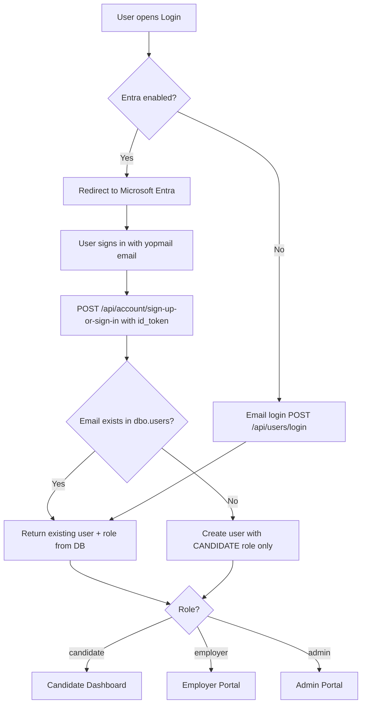
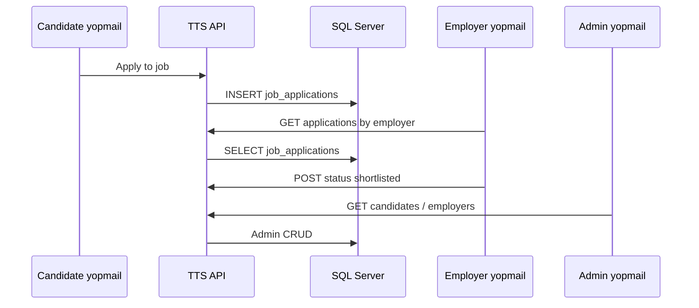

# Tax Talent Solution — Yopmail test accounts & portal flow

## Test accounts

| Role | Email | Platform user ID |
|------|-------|------------------|
| **Candidate** | `fifrapeupuwoi-6176@yopmail.com` | `B2000001-0001-4001-8001-000000000001` |
| **Employer** | `leihammacetou-3371@yopmail.com` | `B2000001-0001-4001-8001-000000000002` |
| **Admin** | `zigocriddoussoi-2038@yopmail.com` | `B2000001-0001-4001-8001-000000000003` |

Related IDs:

| Entity | ID |
|--------|-----|
| Candidate profile | `B2000002-0002-4002-8002-000000000010` |
| Employer company | `B2000003-0003-4003-8003-000000000020` |
| Job posting | `B2000005-0005-4005-8005-000000000040` |
| Job application | `B2000006-0006-4006-8006-000000000050` |

---

## 1. Reset database data (delete all rows)

**Option A — migrations (recommended)**

```powershell
cd d:\Repo\TaxTalentSolution\TaxTalentSolution\TTS\Migrations
..\TTS\env3\Scripts\python.exe migrate.py up
```

Applies pending scripts including:

- `011_truncate_all_data.sql` — deletes all application data (keeps `roles`)
- `012_yopmail_test_users.sql` — inserts yopmail users and sample rows

**Option B — run SQL manually in SSMS / Azure Data Studio**

```sql
-- Step 1: clear data
-- Run full script: sql/011_truncate_all_data.sql

-- Step 2: seed yopmail users
-- Run full script: sql/012_yopmail_test_users.sql
```

**Legacy `employers` table:** If you see errors like `Invalid column name 'name'` on `employers`, use the updated `012` script (dynamic `#InsertEmployer` proc). SQL Server validates static `INSERT` columns at compile time even inside `IF COL_LENGTH(...)` branches.

**Option C — one-shot truncate only (no seed)**

```sql
-- Contents of 011_truncate_all_data.sql
DELETE FROM dbo.interview_feedback;
-- ... (see file for full ordered DELETE list)
DELETE FROM dbo.users;
```

---

## 2. Entra / login flow



**Important:** Pre-seed users **before** first Entra sign-in for employer and admin.  
If an employer/admin signs in **without** a row in `dbo.users`, Entra creates them as **candidate** only.

After running `012_yopmail_test_users.sql`, Entra login matches email and uses the correct role.

**Employer portal** also needs:

- `users.id` = platform UUID (from seed or Entra session)
- `user_employers` row linking user → employer (seeded in 012)

---

## 3. Candidate flow (`fifrapeupuwoi-6176@yopmail.com`)

1. Sign in → Candidate Dashboard  
2. **Profile** — `candidates` row (approved, skills, headline)  
3. **Assessments** — take assessment `B2000004-...` (catalog seeded)  
4. **Certificates** — certificate `B2000007-...` (score 88)  
5. **Job board** — see job from Tax Talent Demo Corp  
6. **Applications** — application `B2000006-...` status `under_review`  
7. **Notifications** — “Application status update”

**Tables touched:** `users`, `candidates`, `candidate_skills`, `user_assessments`, `certificates`, `job_applications`, `notifications`, `user_subscriptions`

---

## 4. Employer flow (`leihammacetou-3371@yopmail.com`)

1. Sign in → Employer Portal  
2. **Dashboard** — KPIs from jobs + applications  
3. **Search Talent** — finds Fifra Candidate; profile view counts from `profile_views`  
4. **Shortlist** — `saved_candidates` (already saved in seed)  
5. **Applications** — update status via API (`job_applications`)  
6. **Jobs** — lists “Senior Tax Analyst - 1040 Specialist”  
7. **Notifications** — bell shows employer notification  
8. **Settings** — company “Tax Talent Demo Corp”

**Tables touched:** `users`, `user_employers`, `employers`, `jobpostings`, `job_applications`, `saved_candidates`, `profile_views`, `notifications`

---

## 5. Admin flow (`zigocriddoussoi-2038@yopmail.com`)

1. Sign in → Admin Portal  
2. **Dashboard** — counts candidates, employers, jobs, applications, certs, admins  
3. **Candidates** — approve/edit Fifra Candidate  
4. **Employers** — manage Tax Talent Demo Corp  
5. **Jobs** — manage job posting  
6. **Assessments** — 1040 assessment catalog  
7. **Users** — three yopmail users visible  

**Tables touched:** `admin_users`, `users`, `candidates`, `employers`, `jobpostings`, `assessments`, etc.

---

## 6. End-to-end hiring flow (all three roles)



---

## 7. Run local stack

```powershell
# 1. Migrations
cd TTS\Migrations
..\TTS\env3\Scripts\python.exe migrate.py up

# 2. API
cd ..\TTS
..\env3\Scripts\python.exe TTS.py

# 3. UI
cd ..\..\TaxTalentSolution
npm run dev
```

---

## 8. Troubleshooting

| Issue | Fix |
|-------|-----|
| Employer: “No employer linked” | Run `012`; confirm `user_employers` for `B2000001-...000002` |
| Employer: “Sign in with UUID” | Session must expose `user.id` = seeded GUID, not only Entra oid |
| Wrong portal after Entra | Email must match `dbo.users.email` exactly (lowercase) |
| Admin `totalAdmins` = 0 | Run `012`; row in `admin_users` for admin user |
| Empty talent search | Candidate `status` must be `approved` or `pending` |

---

## 9. Minimal INSERT reference (single user)

```sql
-- Candidate user only (after roles exist)
INSERT INTO dbo.users (id, name, email, phone, roleid, country, isactive)
VALUES (
  'B2000001-0001-4001-8001-000000000001',
  N'Fifra Candidate',
  N'fifrapeupuwoi-6176@yopmail.com',
  N'+919876543210',
  '8B90FD0B-EB39-482F-82C0-DCF60273D3D4',
  N'IN', 1
);
```

Use full script `012_yopmail_test_users.sql` for complete related data (employer, jobs, applications, certificates, etc.).
